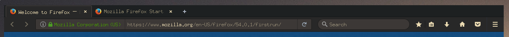

# Gruvbox Arc Firefox Theme
Based on [Arc](https://github.com/horst3180/arc-firefox-theme) Firefox theme with [Gruvbox](git@github.com:3ximus/arc-firefox-theme.git) colorscheme.

## Requirements
This theme is compatible with Firefox 40+ and Firefox 38 ESR

### Manual building and installation
These instructions are for testers and package maintainers. They also allow to install the theme globally for all users.

You will need `autoconf` and `automake` for the following.

Generate the .xpi files (drag and drop these into your Firefox window)

	./autogen.sh --prefix=/usr --disable-light --disable-darker
	make mkxpi

### Notes
	
This may conflict with your the original Arc theme.

I haven't changed some things, like the new tab, or reload page icons so it is not yet a finished version
